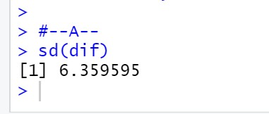

# P2_Probstat_B_5025201020
## Laporan Praktikum Modul 2 Probabilitas dan Statistik 2022

**Nama  : Muhammad Ferdian Iqbal**

**NRP   : 5025201020**

**Kelas : B**

***

## **Soal 1**
Seorang peneliti melakukan penelitian mengenai pengaruh aktivitas 𝐴 terhadap kadar saturasi oksigen pada manusia. Peneliti tersebut mengambil sampel sebanyak 9 responden. Pertama, sebelum melakukan aktivitas 𝐴, peneliti mencatat kadar saturasi oksigen dari 9 responden tersebut. Kemudian, 9 responden tersebut diminta melakukan aktivitas 𝐴. Setelah 15 menit, peneliti tersebut mencatat kembali kadar saturasi oksigen dari 9 responden tersebut. Berikut data dari 9 responden
mengenai kadar saturasi oksigen sebelum dan sesudah melakukan aktivitas 𝐴

``` R
x_data <- c(78, 75, 67, 77, 70, 72, 78, 74, 77)
y_data <- c(100, 95, 70, 90, 90, 90, 89, 90, 100)
dif<- c()
for(i in 1:9)
  dif[i] <- y_data[i] - x_data[i]
```

### A.
> Standar deviasi selisih.

``` R
sd(dif)
```



Standar deviasi dapat dicari dengan fungsi **sd** pada R

### B.
>Carilah nilai t (p-value)

``` R
mean_dif = mean(dif)
mean_sample_data = mean(dif[1:6])
total_n = 6
total_sd = sd(dif[1:6])
t_val = (mean_sample_data - mean_dif) / (total_sd / sqrt(total_n))
p_val = pt(t_val, total_n-1, lower.tail = TRUE)
p_val
```


P-value dari t score dapat dicari dengan mengetahui t score dahulu. T score dapat dicari dengan mengetahui rata-rata data sampel dikurangi dengan rata - rata total data. Kemudian,  dikurangi dengan standar deviasi dari total data sampel yang sudah dibagi dengan akar total sampel.

### C.
> tentukanlah apakah terdapat pengaruh yang signifikan secara statistika dalam hal kadar saturasi oksigen , sebelum dan sesudah melakukan aktivitas 𝐴 jika diketahui tingkat signifikansi 𝛼 = 5% serta H0 : “tidak ada pengaruh yang signifikan secara statistika dalam hal kadar saturasi oksigen , sebelum dan sesudah melakukan aktivitas 𝐴”

``` R
install.packages("BSDA")
library(BSDA)
t.test(dif, alternative = 'two.sided', mu = mean_dif)
```