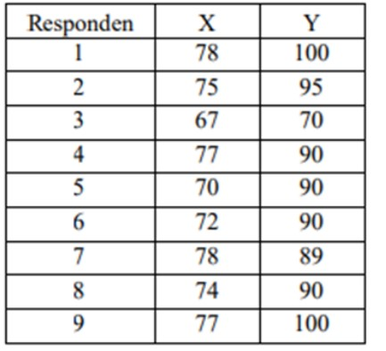
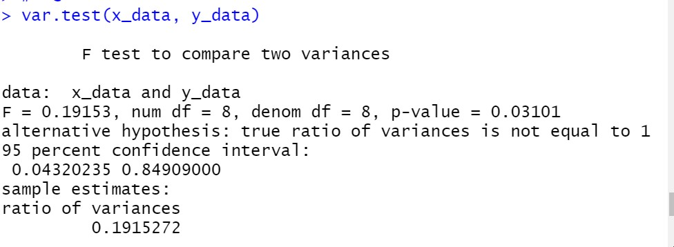
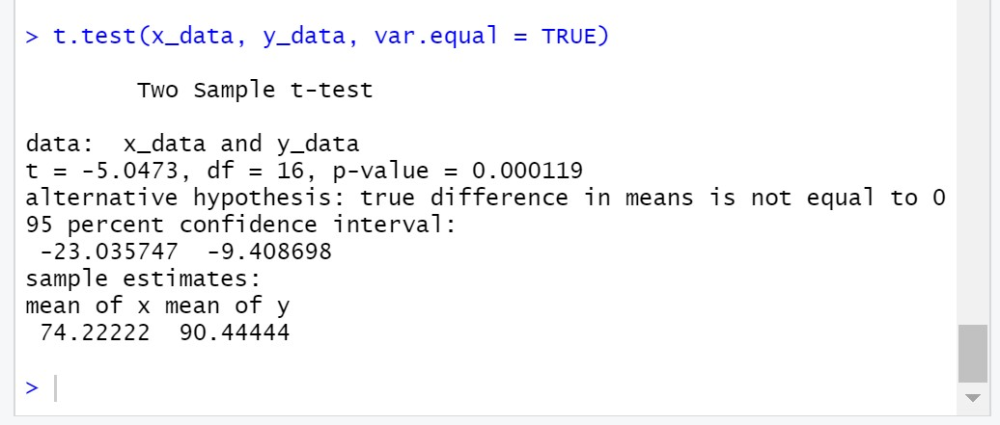
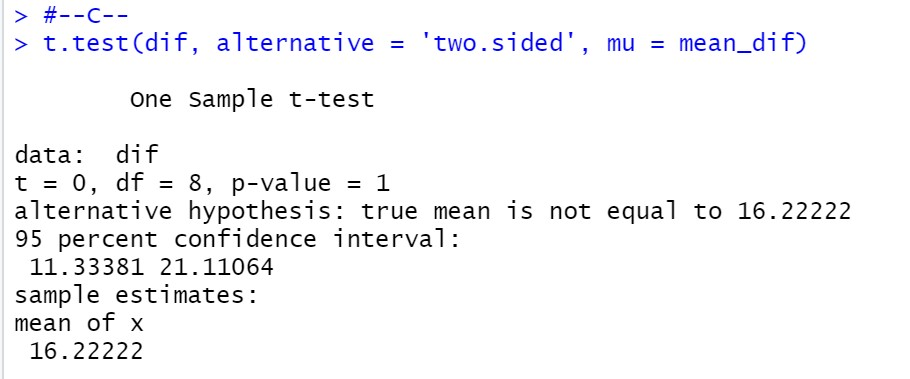

# P2_Probstat_B_5025201020
## Laporan Praktikum Modul 2 Probabilitas dan Statistik 2022

**Nama  : Muhammad Ferdian Iqbal**

**NRP   : 5025201020**

**Kelas : B**

***

## **Soal 1**
Seorang peneliti melakukan penelitian mengenai pengaruh aktivitas 𝐴 terhadap kadar saturasi oksigen pada manusia. Peneliti tersebut mengambil sampel sebanyak 9 responden. Pertama, sebelum melakukan aktivitas 𝐴, peneliti mencatat kadar saturasi oksigen dari 9 responden tersebut. Kemudian, 9 responden tersebut diminta melakukan aktivitas 𝐴. Setelah 15 menit, peneliti tersebut mencatat kembali kadar saturasi oksigen dari 9 responden tersebut. Berikut data dari 9 responden
mengenai kadar saturasi oksigen sebelum dan sesudah melakukan aktivitas 𝐴




``` R
x_data <- c(78, 75, 67, 77, 70, 72, 78, 74, 77)
y_data <- c(100, 95, 70, 90, 90, 90, 89, 90, 100)
dif<- c()
for(i in 1:9)
  dif[i] <- y_data[i] - x_data[i]
```

### A.
> Standar deviasi selisih.

``` R
sd(x_data)
sd(y_data)
sd(dif)
```


Standar deviasi dapat dicari dengan fungsi **sd** pada R. Pada kode tersebut, terdapat standar deviasi sebelum beraktivitas dan sesudah aktivitas. Kemudian, ada juga standar deviasi dari selisih keduanya

### B.
>Carilah nilai t (p-value)

``` R
mean_dif = mean(dif)
mean_sample_data = mean(dif[1:6])
total_n = 6
total_sd = sd(dif[1:6])
t_val = (mean_sample_data - mean_dif) / (total_sd / sqrt(total_n))
p_val = pt(t_val, total_n-1, lower.tail = TRUE)
p_val


```


- P-value dari t score dapat dicari dengan mengetahui t score dahulu. Sebelum menghitung T score, kita harus mengetahui hasi dari pengurangan rata-rata sampel data `mean_sample_data` dengan rata-rata semua data `mean_dif`. Kemudian, kita juga harus mengetahui hasil dari standar deviasi sampel data `total_sd` dengan akar dari total sampel `total_sd`. Hasil dari keduanya dibagi dan menghasilkan t score `t_val`.
- Di sini saya menggunakan dua cara untuk mencari p-value. p-value pertama `0.4708124` saya peroleh dengan perhitungan manual dengan mencari mean dari sampel data dan standar deviasi dari sampel data dahulu. Kemudian, saya juga mencari p-value dengan menggunakan fungsi `t.test` yang menghasilkan p-value 0.9998

### C.
> tentukanlah apakah terdapat pengaruh yang signifikan secara statistika dalam hal kadar saturasi oksigen , sebelum dan sesudah melakukan aktivitas 𝐴 jika diketahui tingkat signifikansi 𝛼 = 5% serta H0 : “tidak ada pengaruh yang signifikan secara statistika dalam hal kadar saturasi oksigen , sebelum dan sesudah melakukan aktivitas 𝐴”

``` R
var.test(x_data, y_data)
t.test(dif, alternative = 'two.sided', mu = mean_dif)
t.test(x_data, y_data, var.equal = TRUE)
```





Pada `var.test` merupakan perbandingan antara data `x_data` dan `y_-_data`. Lalu, dilakukan `t.test` saat dengan parameter `x_data` data sebelum aktivitas dan `y_data` data setelah aktivitas. Selanjutnya juga dilakukan `t.test` dengan parameter `dif` data selisih tiap data. Hasilnya adalah pada `t.test` pertama dan kedua memiliki hasil yang mirip dengan `t.test` 1B. Sehingga dapat disimpulkan tidak ada pengaruh yang signifikan secara statistika dalam hal kadar saturasi oksigen.