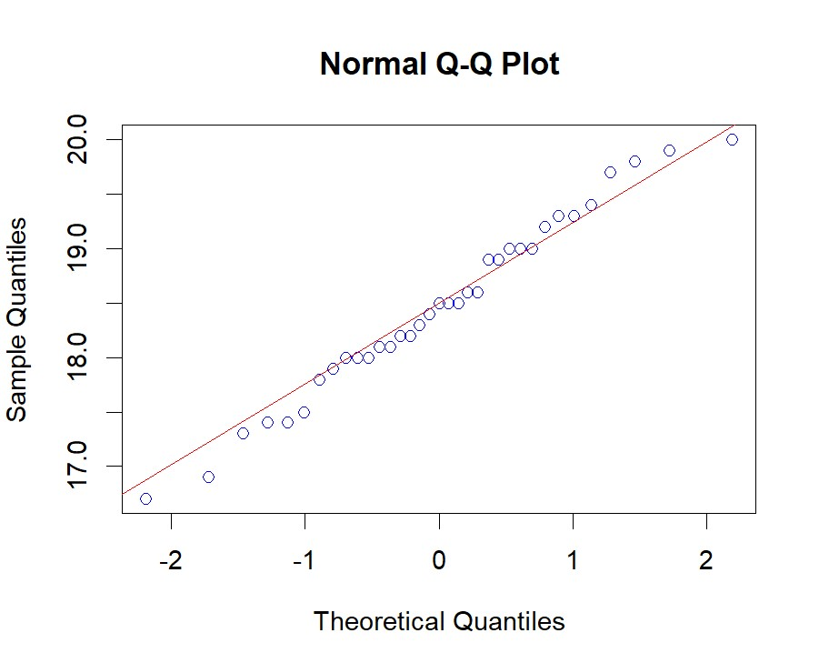

# P2_Probstat_B_5025201020
## Laporan Praktikum Modul 2 Probabilitas dan Statistik 2022

**Nama  : Muhammad Ferdian Iqbal**

**NRP   : 5025201020**

**Kelas : B**

***

## **Soal 1**
Seorang peneliti melakukan penelitian mengenai pengaruh aktivitas 𝐴 terhadap kadar saturasi oksigen pada manusia. Peneliti tersebut mengambil sampel sebanyak 9 responden. Pertama, sebelum melakukan aktivitas 𝐴, peneliti mencatat kadar saturasi oksigen dari 9 responden tersebut. Kemudian, 9 responden tersebut diminta melakukan aktivitas 𝐴. Setelah 15 menit, peneliti tersebut mencatat kembali kadar saturasi oksigen dari 9 responden tersebut. Berikut data dari 9 responden mengenai kadar saturasi oksigen sebelum dan sesudah melakukan aktivitas 𝐴


``` R
x_data <- c(78, 75, 67, 77, 70, 72, 78, 74, 77)
y_data <- c(100, 95, 70, 90, 90, 90, 89, 90, 100)
dif<- c()
for(i in 1:9)
  dif[i] <- y_data[i] - x_data[i]
```

### A.
> Standar deviasi selisih.

``` R
sd(x_data)
sd(y_data)
sd(dif)
```


Standar deviasi dapat dicari dengan fungsi **sd** pada R. Pada kode tersebut, terdapat standar deviasi sebelum beraktivitas dan sesudah aktivitas. Kemudian, ada juga standar deviasi dari selisih keduanya

### B.
>Carilah nilai t (p-value)

``` R
mean_dif = mean(dif)
mean_sample_data = mean(dif[1:6])
total_n = 6
total_sd = sd(dif[1:6])
t_val = (mean_sample_data - mean_dif) / (total_sd / sqrt(total_n))
p_val = pt(t_val, total_n-1, lower.tail = TRUE)
p_val


```


- P-value dari t score dapat dicari dengan mengetahui t score dahulu. Sebelum menghitung T score, kita harus mengetahui hasi dari pengurangan rata-rata sampel data `mean_sample_data` dengan rata-rata semua data `mean_dif`. Kemudian, kita juga harus mengetahui hasil dari standar deviasi sampel data `total_sd` dengan akar dari total sampel `total_sd`. Hasil dari keduanya dibagi dan menghasilkan t score `t_val`.
- Di sini saya menggunakan dua cara untuk mencari p-value. p-value pertama `0.4708124` saya peroleh dengan perhitungan manual dengan mencari mean dari sampel data dan standar deviasi dari sampel data dahulu. Kemudian, saya juga mencari p-value dengan menggunakan fungsi `t.test` yang menghasilkan p-value 0.9998

### C.
> tentukanlah apakah terdapat pengaruh yang signifikan secara statistika dalam hal kadar saturasi oksigen , sebelum dan sesudah melakukan aktivitas 𝐴 jika diketahui tingkat signifikansi 𝛼 = 5% serta H0 : “tidak ada pengaruh yang signifikan secara statistika dalam hal kadar saturasi oksigen , sebelum dan sesudah melakukan aktivitas 𝐴”

``` R
var.test(x_data, y_data)
t.test(dif, alternative = 'two.sided', mu = mean_dif)
t.test(x_data, y_data, var.equal = TRUE)
```


Pada `var.test` merupakan perbandingan antara data `x_data` dan `y_-_data`. Lalu, dilakukan `t.test` saat dengan parameter `x_data` data sebelum aktivitas dan `y_data` data setelah aktivitas. Selanjutnya juga dilakukan `t.test` dengan parameter `dif` data selisih tiap data. Hasilnya adalah pada `t.test` pertama dan kedua memiliki hasil yang mirip dengan `t.test` 1B. Sehingga dapat disimpulkan tidak ada pengaruh yang signifikan secara statistika dalam hal kadar saturasi oksigen.

***

## **Soal 2**
Diketahui bahwa mobil dikemudikan rata-rata lebih dari 20.000 kilometer per tahun. Untuk menguji klaim ini, 100 pemilik mobil yang dipilih secara acak diminta untuk mencatat jarak yang mereka tempuh. Jika sampel acak menunjukkan rata-rata 23.500 kilometer dan standar deviasi 3900 kilometer. 

### A.
> Apakah Anda setuju dengan klaim tersebut?
Setuju
### B.
> Jelaskan maksud dari output yang dihasilkan!

``` R
install.packages("BSDA")
library(BSDA)
t_valB = (23500 - 20000) / (3900 / sqrt(100))
p_valB = pt(t_valB, 99, lower.tail = TRUE)
p_valB
tsum.test(mean.x=23500, s.x=3900, n.x=100, mu=20000)
```


Pada soal 2B, saya menggunakan dua cara. 
  1. Menghitung `t_valB` t score dengan rumus `(mean sampel data - mean total) / (standar deviasi sampel data / akar total sampel)`. Lalu, dengan fungsi `pt()` dihasilkan `p_valB` p-value **1**
  2. Menggunakan fungsi `tsum.test` dengan parameter mean sampel, sd sampel, panjang sampel, dan mean total dihasilkan `p-value` 1.884e-14, `t-score` 8.9744, dan `df` 99.

Alasan saya setuju pada poin A karena hasil dari `tsum.test()`menunjukkan confidental interval dengan batas bawah `22726.16`. Hal tersebut berarti sesuai dengan dugaan bahwa mobil dikemudikan rata-rata lebih dari 20.000 kilometer per tahun.

### C.
> Buatlah kesimpulan berdasarkan P-Value yang dihasilkan!

Berdasarkan P-Value yang diperoleh, pengambilan sampel acak dapat digunakan untuk mengetahui keadaan dengan akurasi yang tinggi.
***

## **Soal 3**
Diketahui perusahaan memiliki seorang data analyst ingin memecahkan permasalahan pengambilan keputusan dalam perusahaan tersebut. Selanjutnya didapatkanlah data berikut dari perusahaan saham tersebut.

Dari data diatas berilah keputusan serta kesimpulan yang didapatkan dari hasil diatas. Asumsikan nilai variancenya sama, apakah ada perbedaan pada rata-ratanya (α = 0.05)?

``` R
mean_x = 3.64
sd_x = 1.67
n_x = 19
mean_y = 2.79
sd_y = 1.32
n_y = 27
```
### A.
> H0 dan H1
Misalkan:
- Rata-rata saham Bandung **A**
- Rata-rata saham Bali **B**
$$H0 => A = B$$
$$H1 => A != B$$

### B. 
> Hitung Sampel Statistik

Hasil dari penghitungan sampel statistik, yaitu :
``` R
varianceSample = (((n_x-1)*(sd_x**2)) + ((n_y-1)*(sd_y**2))) / ((n_x-1) + (n_y-1))
t_xy = (mean_x - mean_y) / (sqrt(varianceSample*((1/n_x) + (1/n_y))))

tsum.test(mean.x=mean_x, 
          s.x = sd_x, 
          n.x = n_x, 
          mean.y =mean_y, 
          s.y = sd_y, 
          n.y = n_y, 
          alternative = "less", 
          var.equal = TRUE)
tsum.test(mean.x=mean_x, 
          s.x = sd_x, 
          n.x = n_x, 
          mean.y =mean_y, 
          s.y = sd_y, 
          n.y = n_y, 
          alternative = "greater", 
          var.equal = TRUE)
tsum.test(mean.x=mean_x, 
          s.x = sd_x, 
          n.x = n_x, 
          mean.y =mean_y, 
          s.y = sd_y, 
          n.y = n_y, 
          alternative = "two.sided", 
          var.equal = TRUE)
```


Mencari Sample Statistik dilakukan dengan mengetahui `SampleVariance` terlebih dahulu. Kemudian dimasukkan ke rumus berikut sehingga menghasilkan `t_xy`. $Sp^2$ adalah `Sample Variance`, $\bar{X}$ adalah $n$ atau `n_x dan n_y` adalah data Bandung dan Bali, $\mu$ adalah `mean populasi`. 


## C.
> Lakukan Uji Statistik (df = 2)

### D.
> Nilai Kritikal

Nilai Kritikal dapat ditentukan dengan besar kedua sampel, nilai $\alpha$, dan melihat tabel t.


- Hitung `df`
$$df = n_x + n_y - 2$$
$$df = 19 + 27 - 2$$
$$df = 44$$

- Hubungkan dengan nilai $\alpha$, yaitu `0.05`. Ambil pilihan $\alpha$ yang bawah karena itu untuk uji dua sampel.

- Dari tabel tersebut, hasil nilai kritikal adalah `2.01537`

### E.
> Keputusan

$H0$ diterima pada $\alpha$ = `0.05`.
### F.
> Kesimpulan

Berdasarkan penghitungan sampel statistik, nilai sampel statistik berada di antara nilai kritikal.

***
## **Soal 4**
Seorang Peneliti sedang meneliti spesies dari kucing di ITS . Dalam penelitiannya ia mengumpulkan data tiga spesies kucing yaitu kucing oren, kucing hitam dan kucing putih dengan panjangnya masing-masing.
Jika diketahui dataset https://intip.in/datasetprobstat1
H0 : Tidak ada perbedaan panjang antara ketiga spesies atau rata-rata panjangnya sama

### A.
> Buatlah masing masing jenis spesies menjadi 3 subjek "Grup" (grup 1,grup 2,grup 3). Lalu Gambarkan plot kuantil normal untuk setiap kelompok dan lihat apakah ada outlier utama dalam homogenitas varians.

- Ambil data dari sumber yang diberikan dan disimpan ke dalam variable

``` R
cats <- read.table(url("https://rstatisticsandresearch.weebly.com/uploads/1/0/2/6/1026585/onewayanova.txt"), header = T)
```

- Masukkan ke setiap group dengan pembagian berdasarkan nomor group

``` R
group1 <- cats[cats["Group"]=="1",]
group2 <- cats[cats["Group"]=="2",]
group3 <- cats[cats["Group"]=="3",]
```

- Gambarkan dengan fungsi `qqnorm()` dan `qqline()` setiap data yang ada

``` R
qqnorm(y = group1$Length, col="blue")
qqline(y = group1$Length, col="red")
```



``` R
qqnorm(y = group2$Length, col="blue")
qqline(y = group2$Length, col="red")
```


``` R
qqnorm(y = group3$Length, col="blue")
qqline(y = group3$Length, col="red")
```


- Penentuan homogenitas Varians dapat dilakukan dengan menentukan varians tiap group dan diamati perbedaan hasilnya. Berdasarkan hasil dari ketiganya, varians yang paling berbeda adalah varians `group3` yaitu `0.8476975`.


### B.
> Carilah atau periksalah Homogeneity of variances nya , Berapa nilai p yang didapatkan? , Apa hipotesis dan kesimpulan yang dapat diambil ?

``` R
bartlett.test(Length ~ Group, data = cats)

#Bartlett test of homogeneity of variances
#data:  Length by Group
#Bartlett's K-squared = 0.43292, df = 2, p-value = 0.8054
```


Homogeneity of variances dapat dicari menggunakan fungsi `bartlett.test()`. Fungsi tersebut menghasilkan nilai Bartlett `0.43292`, df `2`, dan p-value `0.8054`. Berdasarkan hasil tersebut, dapat disimpulkan bahwa Tidak ada perbedaan panjang antara ketiga spesies atau rata-rata panjangnya sama


### C.
> Untuk uji ANOVA (satu arah), buatlah model linier dengan Panjang versus Grup dan beri nama model tersebut model 1.

``` R
model1 = lm(cats$Length ~ cats$Group)
summary(model1)
```


Model linier dapat dicari dengan fungi `lm()`. Hasil dari fungsi tersebut dalah Median, min, max, quartil 1, quartil 3, t value, dan masih banyak lagi (bisa dilihat di screenshoot)

### D. 
> Dari Hasil Poin C, Berapakah nilai-p ? , Apa yang dapat Anda simpulkan dari H0?

Berdasarkan hasil yang diperoleh di poin C, didapat nilai P `0.64`. Berdasarkan hasil tersebut, dapat disimpulkan bahwa Tidak ada perbedaan panjang antara ketiga spesies atau rata-rata panjangnya sama

### E.
> Verifikasilah jawaban model 1 dengan Post-hoc test Tukey HSD, dari nilai p yang didapatkan apakah satu jenis kucing lebih panjang dari yang lain?

``` R
mean_g1 = mean(group1$Length)
mean_g2 = mean(group2$Length)
mean_g3 = mean(group3$Length)

mean_g1
mean_g2
mean_g3

temp_aov <- aov(Length~Group, data = cats)
TukeyHSD(temp_aov)
```


Berdasarkan hasil yang didapat, `grup 2 paling mempengaruhi besarnya p-value`. Dapat dilihat ketika group 2 dibandingkan dengan group lainnya, menghasilkan p-value yang kecil. Sedangkan ketika group 1 dan 3 dibandingkan menghasilkan p-value yang lebih besar. Dapat dilihat dengan perbandingan mean juga, group 2 paling kecil nilainya. Oleh karena itu, satu jenis kucing lebih panjang dari yang lain

### F.
> Visualisasikan data dengan ggplot2

``` R
#install.packages("ggplot2")
library(ggplot2)
ggplot(cats, aes(x=Group, y=Length)) + 
  geom_point() + geom_smooth(aes(x=Group, y=Length)) + 
  labs(title="Cats Visualization", x="Group", y="Length (cm)")
```


***
## **Soal 5**
Data yang digunakan merupakan hasil eksperimen yang dilakukan untuk mengetahui pengaruh suhu operasi (100˚C, 125˚C dan 150˚C) dan tiga jenis kaca pelat muka (A, B dan C) pada keluaran cahaya tabung osiloskop. Percobaan
dilakukan sebanyak 27 kali dan didapat data sebagai berikut: Data Hasil Eksperimen.

### A.
> Buatlah plot sederhana untuk visualisasi data
### B.
> Lakukan uji ANOVA dua arah
### C.
> Tampilkan tabel dengan mean dan standar deviasi keluaran cahaya untuk setiap perlakuan (kombinasi kaca pelat muka dan suhu operasi)
### D.
> Lakukan uji Tukey
### E.
> Gunakan compact letter display untuk menunjukkan perbedaan signifikan antara uji Anova dan uji Tukey